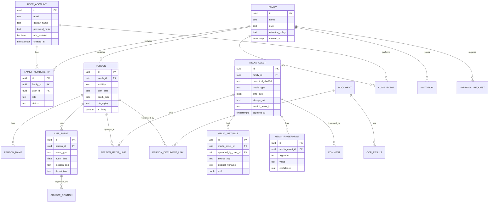

# Family Tree - Unified Master Plan

Project: **Family Tree**  
Organization: **AOM Legacy**  
Domain: **AOMLegacy.com**  
Founder: **Fatih Maytalman**  
Document status: **Strategic product and architecture baseline**

## Executive thesis

Family Tree is a complete digital family ecosystem: a private media cloud, genealogy system, collaborative archive, AI heritage assistant, and long-term preservation platform. The product must solve the immediate family pain caused by WhatsApp-style media duplication while building a trustworthy foundation for multi-generational history.

The correct first move is not to rebuild every media primitive from scratch. Phase 1 should combine Immich's mature media ingestion and mobile sync capabilities with AOM Legacy's own product layer for family identity, permissions, genealogy, AI, deduplication policy, auditability, and long-term export. This keeps the self-hosted MVP practical on a repurposed Ubuntu laptop while preserving a path to cloud-scale infrastructure.

## Non-negotiable principles

1. **One family memory, one canonical asset.** Multiple people may own, tag, comment on, or reference the same memory, but the platform stores one durable original whenever the file is identical or confidently equivalent.
2. **Privacy before convenience.** Family media, relationship data, and documents are deeply sensitive. Security choices must assume breach attempts, device loss, and family-level access disputes.
3. **Local-first phase, cloud-ready architecture.** The Phase 1 home server must be useful immediately, but no data model or storage format should trap the project there.
4. **Fifty-year portability.** Families must be able to export media, metadata, graph relationships, biographies, documents, and audit history in open formats.
5. **Ages 8 to 88 usability.** The platform must feel calm, simple, and emotionally resonant even when the underlying system is technically sophisticated.
6. **AI assists, humans decide.** AI may suggest, summarize, transcribe, translate, and detect duplicates, but sensitive changes require traceability and human approval.

## Recommended product framing

**Family Tree is the private operating system for a family's digital legacy.**

It starts by making family media chaos disappear:

- phones stop filling with duplicated photos and videos,
- everyone uploads once into a shared library,
- duplicates are skipped or linked automatically,
- faces, dates, places, stories, documents, and family relationships become searchable,
- and each generation receives a living archive rather than a pile of files.

---

# Phase 1 - Product Requirements Document (PRD)

## 1.1 Product overview

Family Tree is a self-hosted-first, AI-powered platform for preserving family media, genealogy, documents, stories, and historical context. The initial product runs on a home Ubuntu server with Docker, Immich, Tailscale, local USB media storage, and a custom AOM Legacy application layer.

## 1.2 Core user problem

Families communicate in messaging apps. Those apps optimize for sharing, not preservation. The same files are downloaded by many people, local storage fills up, context is lost, and irreplaceable history remains unstructured.

Family Tree must create a single trusted place where:

- a photo uploaded by one family member becomes available to the family according to permissions,
- duplicated files are automatically detected,
- family members are tagged and connected to profiles,
- stories and documents become searchable,
- and the full archive can outlive individual devices, subscriptions, and apps.

## 1.3 Target users

| Persona | Needs | Product implications |
| --- | --- | --- |
| Family archivist | Preserve everything, organize people, correct metadata, export books | Powerful admin tools, bulk upload, merge workflows, provenance |
| Parent | Automatic photo backup, easy sharing, privacy | Mobile background sync, family albums, low-friction upload |
| Grandparent | View memories, add stories, identify faces | Large touch targets, guided flows, voice notes, simple commenting |
| Teen/child | Find photos, contribute casually | Fast mobile experience, invite permissions, safe defaults |
| Deceased member steward | Memorialize a loved one | Memorial profiles, consent model, timeline controls |
| Future descendant | Discover family history decades later | Open exports, durable metadata, chronological storytelling |

## 1.4 Goals

### Phase 1 goals

- Deploy a self-hosted media foundation using Ubuntu, Docker Compose, Immich, PostgreSQL, Redis, and local volumes.
- Enable mobile photo/video backup through Immich over Tailscale.
- Add a custom Family Tree domain model for family members, profiles, relationships, media links, and permissions.
- Implement exact and near-duplicate detection for media imported into the AOM Legacy layer.
- Provide a basic web app for family profiles, timeline, media search, and upload review.
- Establish backup, audit, and export foundations from the beginning.

### Product-wide goals

- Build the best private family archive experience for real households.
- Support complex family structures without judgment or forced simplification.
- Make memories searchable by people, places, dates, documents, and semantic meaning.
- Support AI-assisted biography, OCR, translation, transcription, relationship discovery, and family Q&A.
- Scale from one home server to cloud-hosted multi-tenant deployments.

## 1.5 Non-goals for MVP

- Public social network features.
- DNA matching or medical genealogy.
- Blockchain certificates.
- White-label enterprise tenanting.
- Full offline-first native app beyond reliable background upload.
- Fully automated sensitive family-tree changes without human review.

## 1.6 MVP user stories

### Media and deduplication

- As a family member, I can install the mobile app and have new photos/videos uploaded automatically.
- As a family member, I can upload old folders from a laptop or drive.
- As a family member, I do not create a duplicate if my spouse already uploaded the same WhatsApp image.
- As an archivist, I can review near-duplicate candidates before merging.
- As a family member, I can search for memories by date, person, location, or text.

### Family profiles

- As an archivist, I can create a person profile with name, birth/death dates, relationships, notes, and media.
- As a family member, I can open a person's profile and see a life timeline.
- As a family member, I can attach photos, videos, documents, and stories to a person.
- As an admin, I can merge duplicate person records.

### Collaboration

- As an admin, I can invite relatives and assign view/edit/admin roles.
- As a contributor, I can comment on a photo or add context.
- As an admin, I can approve sensitive edits such as parentage, adoption, divorce, or memorial changes.

### Preservation

- As an archivist, I can export a family archive bundle.
- As an admin, I can see backup health and last successful sync.
- As an admin, I can restore from backup in a documented way.

## 1.7 Functional requirements

1. Mobile background upload for photos and videos.
2. Exact duplicate detection by cryptographic content hash.
3. Near-duplicate detection by perceptual image/video fingerprints.
4. Canonical media asset model with many ownership/link records.
5. Person profile CRUD.
6. Relationship CRUD with validation for impossible cycles in biological ancestry.
7. Timeline events with source citations.
8. Commenting and story attachment.
9. Basic OCR for documents.
10. Face detection/tag suggestion with human confirmation.
11. Role-based access control.
12. Audit log for security and historical edits.
13. Backup job reporting.
14. Open export in structured JSON/CSV plus original media.

## 1.8 Non-functional requirements

| Area | Requirement |
| --- | --- |
| Security | TLS, MFA, RBAC, audit logs, malware scanning, rate limiting, encrypted secrets |
| Privacy | Data minimization, consent tracking, private-by-default uploads |
| Performance | Fast timeline and album browsing on home hardware |
| Reliability | Nightly backups, restore drills, drive health monitoring |
| Portability | Export all first-party metadata independent of Immich internals |
| Accessibility | WCAG 2.2 AA target, large text modes, keyboard support |
| Internationalization | Unicode names, multilingual documents, future RTL support |
| Maintainability | Modular services, documented runbooks, reproducible Docker Compose |

## 1.9 Success metrics

- Duplicate storage avoided: percentage of uploads linked to existing assets.
- Upload completion rate from mobile devices.
- Time to find a specific memory.
- Number of person profiles enriched with media and timeline data.
- Backup success rate and restore test success.
- Family member activation rate after invite.
- AI suggestion acceptance/rejection rate.

## 1.10 Key risks and mitigations

| Risk | Impact | Mitigation |
| --- | --- | --- |
| Home USB drive failure | Data loss | 3-2-1 backup path, SMART monitoring, mirror drive, cloud backup option |
| Immich schema churn | Integration fragility | Treat Immich as media subsystem, maintain first-party canonical metadata |
| Mobile background limits | Missed uploads | Use Immich mobile app initially; later native app wraps proven patterns |
| False duplicate merges | Lost context/trust | Never delete originals until confidence and retention policy allow; human review near-duplicates |
| Family privacy conflicts | Product harm | Granular permissions, memorial policies, consent-aware sharing |
| AI hallucinations | Incorrect history | Source citations, confidence labels, approval workflow |

---

# Phase 2 - Complete System Architecture

## 2.1 Architecture stance

Use a modular monolith for the first custom application, with clear module boundaries that can later split into services. Keep the operational surface small on the home server while isolating high-cost work through job queues.

## 2.2 Logical components

```text
Mobile Apps / Web App
        |
        | HTTPS over Tailscale / Cloudflare
        v
Reverse Proxy (Nginx/Caddy)
        |
        +--> Immich Web/API/Machine Learning
        |
        +--> AOM Legacy API (NestJS)
                |
                +--> PostgreSQL: users, profiles, media metadata, audit
                +--> Neo4j: family relationships
                +--> Redis: cache, sessions, Bull queues
                +--> Qdrant/Weaviate: embeddings and semantic search
                +--> Local object storage volumes / Immich library
                +--> AI providers and local AI workers
```

## 2.3 Data ownership boundaries

| Component | Owns | Does not own |
| --- | --- | --- |
| Immich | Raw media ingestion, thumbnails, basic albums, mobile sync, EXIF extraction | Family tree semantics, canonical genealogy truth, approval workflows |
| AOM Legacy API | Users, families, roles, person profiles, relationships, dedup decisions, audit, AI workflows | Low-level mobile camera roll sync in Phase 1 |
| Neo4j | Relationship graph and path queries | User auth, files, audit logs |
| Vector DB | Embeddings and similarity retrieval | Durable source of truth |
| Backup system | Recovery copies and manifests | Business logic |

## 2.4 Deployment modes

### Phase 1 home server

- One Ubuntu host.
- Docker Compose.
- Tailscale private access.
- Local ext4 mounted drives.
- Nightly rsync mirror.
- Optional Cloudflare DNS for future domain readiness.

### Phase 2 small hosted deployment

- Single VPS or mini cluster.
- S3-compatible object storage.
- Managed PostgreSQL optional.
- Backup to separate storage account.
- Cloudflare Zero Trust or Tailscale for admin access.

### Phase 3+ cloud scale

- Kubernetes.
- Managed Postgres.
- Neo4j cluster or graph service.
- Redis cluster.
- S3/R2 media storage.
- Queue workers autoscaled by media backlog.
- Tenant-aware identity and isolation.

## 2.5 Integration with Immich

Phase 1 should integrate with Immich through supported APIs and filesystem-level event ingestion where necessary. Avoid modifying Immich internals. Maintain a separate mapping table from AOM canonical media assets to Immich asset IDs.

Recommended pattern:

1. Immich receives upload.
2. Event sync worker polls or subscribes to new Immich assets.
3. AOM media ingestion worker calculates hashes and fingerprints.
4. AOM stores canonical asset metadata and dedup decisions.
5. UI surfaces AOM family context while linking back to Immich originals/thumbnails.

## 2.6 Reliability architecture

- All background work must be idempotent.
- Every imported file gets a content hash and immutable media ID.
- Original files are never overwritten.
- Deletes are soft-deletes until retention expires.
- Backup manifests include checksums.
- Restore runbooks are versioned in the repo.

---

# Phase 3 - Database Design and ERD

## 3.1 PostgreSQL role

PostgreSQL is the primary source of truth for account, family, profile, media, permissions, timelines, documents, audit, deduplication, and AI workflow state.

## 3.2 Core relational entities



## 3.3 Important tables

### Identity and family scope

- `user_account`
- `auth_session`
- `mfa_factor`
- `family`
- `family_membership`
- `invitation`
- `role_assignment`

### People and genealogy

- `person`
- `person_name`
- `person_merge`
- `life_event`
- `location`
- `source_citation`
- `relationship_edge_shadow` for relational snapshots of Neo4j edges.

### Media and documents

- `media_asset`
- `media_instance`
- `media_fingerprint`
- `media_derivative`
- `person_media_link`
- `album`
- `album_item`
- `document`
- `ocr_result`
- `transcription`

### Collaboration and governance

- `comment`
- `story`
- `approval_request`
- `approval_decision`
- `audit_event`
- `notification`

### AI

- `ai_job`
- `ai_observation`
- `embedding_record`
- `suggestion`
- `prompt_template_version`

## 3.4 Data portability

Export must include:

- Original media files.
- Sidecar metadata in JSON.
- GEDCOM-compatible genealogy export where possible.
- Graph export as CSV/GraphML.
- Timeline export as JSON and CSV.
- Biographies and stories as Markdown.
- Audit log export for admins.

---

# Phase 4 - Graph Data Model (Neo4j Family Relationships)

## 4.1 Why Neo4j

Genealogy is relationship-heavy. Neo4j supports efficient path finding, cousin calculations, relationship discovery, ancestry validation, and visual tree queries that are awkward in relational joins.

## 4.2 Node labels

- `Family`
- `Person`
- `Place`
- `Event`
- `Source`
- `MediaAsset`

## 4.3 Relationship types

| Type | Direction | Properties |
| --- | --- | --- |
| `PARENT_OF` | Person -> Person | biological, adoptive, foster, step, guardianship, confidence, startDate, endDate |
| `SPOUSE_OF` | Person -> Person | marriageDate, divorceDate, status, location |
| `PARTNER_OF` | Person -> Person | startDate, endDate, status |
| `SIBLING_OF` | Person -> Person | derived or asserted, confidence |
| `CHILD_OF` | Person -> Person | usually derived inverse |
| `LIVED_IN` | Person -> Place | startDate, endDate |
| `PARTICIPATED_IN` | Person -> Event | role |
| `APPEARS_IN` | Person -> MediaAsset | boundingBox, confirmedBy, confidence |
| `DOCUMENTED_BY` | Person/Event -> Source | citation, confidence |

## 4.4 Validation rules

1. Biological `PARENT_OF` cannot create ancestry cycles.
2. A person cannot be their own ancestor or descendant.
3. Date constraints should warn, not always block, because historical records may be wrong.
4. Multiple parent relationships are allowed, but type and confidence must be explicit.
5. Relationship edits affecting parentage, adoption, divorce, guardianship, or deceased profiles require audit and optional approval.

## 4.5 Example Cypher

```cypher
// Detect whether adding parent -> child would create a biological cycle.
MATCH (parent:Person {id: $parentId}), (child:Person {id: $childId})
MATCH path = (child)-[:PARENT_OF*1..]->(parent)
RETURN count(path) > 0 AS wouldCreateCycle;
```

```cypher
// Find the shortest known relationship path between two people.
MATCH (a:Person {id: $personA}), (b:Person {id: $personB})
MATCH path = shortestPath((a)-[:PARENT_OF|SPOUSE_OF|PARTNER_OF*..12]-(b))
RETURN path;
```

## 4.6 Relational synchronization

Every Neo4j relationship edge should have a PostgreSQL shadow row for audit, approval, export, and disaster recovery. Neo4j is optimized for graph queries, but PostgreSQL remains the compliance-friendly ledger.

---

# Phase 5 - AI Architecture

## 5.1 AI responsibilities

AI should enrich the archive, not become the source of truth. All AI outputs must include provenance, model identity, prompt template version, confidence, and review state.

## 5.2 AI capabilities

| Capability | Primary implementation | Human review |
| --- | --- | --- |
| Biography generation | LLM summarizes approved facts, stories, and events | Required before publishing |
| Heritage Q&A | RAG over profiles, OCR, stories, timelines | Answer includes citations |
| OCR | Tesseract locally, cloud OCR later if needed | Review for official docs |
| Translation | LLM or specialist translation model | Review for archival accuracy |
| Voice transcription | Whisper local or hosted | Review for memorial/official content |
| Semantic photo search | CLIP-style embeddings and metadata | Not required |
| Face clustering | Immich/InsightFace | Confirmation required for identity |
| Duplicate detection | Hash, perceptual hash, embeddings | Required for near-duplicate deletion |
| Relationship discovery | Graph + LLM suggestions | Required |

## 5.3 Model routing

Use a privacy-tiered AI router:

1. **Local-only tier:** faces, private documents, minors, sensitive legal files, unpublished memorial content.
2. **Trusted hosted tier:** biography drafting, OCR cleanup, translation, general Q&A with redaction.
3. **Public-safe tier:** generic historical context that does not include personal private data.

## 5.4 RAG architecture

```text
Source data
  -> extraction workers
  -> normalized text chunks with citations
  -> embeddings
  -> vector database
  -> retrieval policy filters by family, user role, living/deceased status, sensitivity
  -> LLM response with citations
  -> audit and feedback capture
```

## 5.5 Prompt safety rules

- Never answer from memory when a family-specific answer requires sources.
- Display "I do not know from the archive yet" when evidence is missing.
- Cite every document, story, media item, or profile fact used.
- Separate fact, inference, and speculation.
- Avoid exposing hidden profiles or restricted documents through semantic retrieval.

## 5.6 AI job lifecycle

1. Job is requested by user or system.
2. Inputs are policy-filtered.
3. Sensitive data classification runs.
4. Model route is selected.
5. Prompt template version is recorded.
6. Output is stored as a suggestion, draft, transcript, embedding, or observation.
7. User accepts, edits, rejects, or asks for another pass.
8. Decision is audit logged.

---

# Phase 6 - Security Architecture

## 6.1 Security model

Family Tree must assume high emotional and legal sensitivity. Security architecture should be explicit from day one, even in the self-hosted MVP.

## 6.2 Identity and access

- Email/password plus passkey support when feasible.
- MFA for admins and recommended for all users.
- Invite-only family access for private deployments.
- RBAC roles: owner, admin, archivist, contributor, viewer, child viewer, guest.
- Attribute-based checks for living persons, minors, memorial pages, legal documents, and restricted albums.

## 6.3 Data protection

- TLS 1.3 at all public edges.
- Tailscale WireGuard tunnels for Phase 1 remote access.
- Disk encryption for internal SSD and external drives where operationally possible.
- Application-level encryption for sensitive documents and private notes.
- Secrets stored outside git in environment files or secret managers.
- Passwords hashed with Argon2id.

## 6.4 Upload security

1. Authenticate and authorize upload.
2. Store original in quarantine or staging.
3. Calculate SHA-256 before processing.
4. Run malware scan with ClamAV or equivalent.
5. Extract metadata in a sandboxed worker.
6. Generate thumbnails/derivatives.
7. Run deduplication.
8. Move to canonical storage only after validation.

## 6.5 Audit requirements

Log:

- sign-ins and failed sign-ins,
- MFA changes,
- invite creation and acceptance,
- media uploads/deletes/restores,
- profile and relationship edits,
- permission changes,
- AI job requests and approvals,
- exports,
- backup/restore actions.

Audit records should be append-only for normal application flows.

## 6.6 GDPR and privacy

- Data export per family and per user.
- Right-to-erasure workflows with family-history exceptions clearly handled.
- Consent tracking for living persons.
- Special handling for minors.
- Privacy policy and data processing records before public launch.
- Regional storage controls for hosted deployments.

## 6.7 Threats and controls

| Threat | Control |
| --- | --- |
| Stolen password | MFA, rate limiting, login alerts |
| Lost phone | session revocation, device list |
| Malicious upload | malware scan, content type validation, sandbox extraction |
| Unauthorized family browsing | RBAC/ABAC checks on every query |
| AI data leakage | retrieval filters, redaction, local model routing |
| Drive theft | disk encryption |
| Ransomware | offline backups, immutable cloud backup option |
| Family admin abuse | audit logs, approval workflows, export transparency |

---

# Phase 7 - UI/UX Design System

## 7.1 Brand experience

The interface should feel like a premium digital family museum: calm, tactile, respectful, and modern. The product should avoid both clinical enterprise styling and playful social-media chaos.

## 7.2 Visual identity

| Token | Value | Usage |
| --- | --- | --- |
| `navy-950` | `#0D1B2A` | primary navigation, hero backgrounds |
| `gold-500` | `#C9A84C` | accents, key actions, heritage markers |
| `turquoise-500` | `#2EC4B6` | active states, discovery moments |
| `charcoal-950` | `#1A1A2E` | dark surfaces |
| `cream-50` | `#F8F4EE` | light surfaces |
| `warm-white` | `#F0EDE8` | text on dark |

Typography:

- Display: Playfair Display.
- Body: Inter.
- Mono: JetBrains Mono.

## 7.3 Core UX patterns

- **Home:** "Today in your family's story", recent uploads, people needing identification, backup health.
- **Timeline:** chronological family memory stream with filters by person, location, event, media type.
- **People:** profile cards, relationship paths, life event summaries.
- **Memory detail:** media, metadata, faces, comments, story, source/provenance, related memories.
- **Archive review:** duplicate candidates, OCR review, face tag confirmation, AI suggestions.
- **Family tree:** interactive graph with simple mode and expert mode.

## 7.4 Accessibility

- WCAG 2.2 AA.
- High-contrast mode.
- Large text support.
- Keyboard navigation for tree and media grids.
- Reduced-motion mode.
- Voice-note-first contribution flows for older relatives.
- Plain-language labels and confirmation screens.

## 7.5 Emotional design rules

- Avoid dark patterns and engagement addiction mechanics.
- Use respectful language for death, divorce, adoption, and conflict.
- Make "uncertain" and "family says" first-class states, not errors.
- Celebrate milestones without exposing private data outside permissions.

---

# Phase 8 - Backend Architecture (NestJS + APIs)

## 8.1 Backend shape

Use NestJS with a modular monolith architecture:

- `AuthModule`
- `FamiliesModule`
- `PeopleModule`
- `RelationshipsModule`
- `MediaModule`
- `DedupModule`
- `DocumentsModule`
- `TimelineModule`
- `SearchModule`
- `AiModule`
- `AuditModule`
- `BackupModule`
- `NotificationsModule`

## 8.2 API style

Use both GraphQL and REST where each fits:

- GraphQL for tree/profile/timeline views where clients need shaped data.
- REST for uploads, downloads, webhooks, exports, health, and admin operations.

## 8.3 Example API surface

### REST

- `POST /api/media/uploads`
- `GET /api/media/:id/original`
- `GET /api/media/:id/thumbnail`
- `POST /api/media/:id/dedup-review`
- `POST /api/documents/:id/ocr`
- `POST /api/export/families/:familyId`
- `GET /api/admin/backup-health`

### GraphQL

- `family(id)`
- `person(id)`
- `people(filter)`
- `timeline(familyId, filter)`
- `relationshipPath(personAId, personBId)`
- `mediaSearch(query)`
- `aiSuggestions(personId)`

## 8.4 Background workers

Use Bull/BullMQ with Redis for:

- media hash calculation,
- thumbnail generation coordination,
- perceptual fingerprinting,
- video keyframe extraction,
- OCR,
- transcription,
- embedding creation,
- AI biography generation,
- backup manifest generation,
- export bundle creation.

## 8.5 API invariants

- Every request is scoped to a family.
- Authorization checks happen in resolvers/controllers and service methods.
- Media deletes are soft-delete operations unless a retention workflow finalizes them.
- AI-generated data is never silently promoted to source-of-truth fields.
- Every mutation emits an audit event.

---

# Phase 9 - Frontend Architecture (Next.js)

## 9.1 Framework

Use Next.js App Router with TypeScript, Tailwind CSS, Framer Motion, and React Query/TanStack Query for client data synchronization.

## 9.2 App routes

```text
/                      public landing page
/login                 authentication
/families              family switcher
/family/[id]           dashboard
/family/[id]/timeline  family timeline
/family/[id]/people    people directory
/family/[id]/people/[personId]
/family/[id]/tree      interactive tree
/family/[id]/media     media library
/family/[id]/review    dedup/faces/OCR/AI review queue
/family/[id]/settings  roles, backups, export, privacy
```

## 9.3 State and data

- Server Components for shell and initial data where possible.
- Client Components for tree interactions, upload progress, media grids, and review tools.
- TanStack Query for client cache and mutations.
- GraphQL typed operations generated from schema.

## 9.4 UI foundations

- Tailwind theme implements the design tokens from Phase 7.
- Component library starts small: Button, Card, TimelineItem, PersonAvatar, MediaGrid, ReviewDecision, SourceCitation, TreeCanvas.
- Framer Motion is used sparingly for transitions, memory reveal, and tree navigation.

## 9.5 Performance rules

- Virtualize large media grids.
- Use responsive thumbnails, not originals.
- Lazy-load graph neighborhoods.
- Keep initial dashboard fast on home-server hardware.
- Avoid client-side fetching waterfalls.

---

# Phase 10 - Mobile Architecture (React Native + Expo)

## 10.1 Phase 1 mobile decision

Use Immich's mobile app immediately for reliable camera backup. Build the AOM Legacy mobile app in parallel for family workflows once the backend stabilizes.

## 10.2 AOM Legacy mobile responsibilities

- Family dashboard.
- Profile browsing.
- Capture voice stories.
- Review face suggestions.
- Comment on memories.
- Approve sensitive edits.
- Trigger upload to Immich or future native sync module.

## 10.3 Background sync requirements

When custom sync is built:

- Native background task integration for iOS and Android.
- Incremental camera roll scanning.
- Local upload manifest to avoid repeated retries.
- Network policy: WiFi-only or WiFi+mobile data.
- Battery-aware scheduling.
- Resume interrupted uploads.
- Client-side pre-hash where practical.

## 10.4 Mobile security

- Secure token storage.
- App lock with biometrics.
- Remote session revocation.
- No long-term storage of unencrypted sensitive documents.
- Privacy-preserving notifications.

---

# Phase 11 - Self-Hosted Infrastructure (Ubuntu + Docker + USB Drives)

## 11.1 Hardware layout

| Drive | Size | Role | Mount |
| --- | --- | --- | --- |
| Internal SSD | 2TB | OS, Docker, databases | `/` and `/srv/aomlegacy` |
| External USB 1 | 2TB | Primary media library | `/mnt/aom-media-primary` |
| External USB 2 | 1.5TB | Backup mirror | `/mnt/aom-media-backup` |
| External USB 3 | 150GB | Thumbnails/cache/temp | `/mnt/aom-cache` |

## 11.2 Filesystem and mounting

- Format drives as ext4.
- Mount by UUID in `/etc/fstab`.
- Use `nofail` for external drives so the server boots.
- Use ownership and permissions dedicated to Docker service users.
- Document UUIDs and replacement process in a runbook.

Example fstab shape:

```fstab
UUID=<primary-media-uuid> /mnt/aom-media-primary ext4 defaults,nofail,noatime 0 2
UUID=<backup-media-uuid>  /mnt/aom-media-backup  ext4 defaults,nofail,noatime 0 2
UUID=<cache-drive-uuid>   /mnt/aom-cache         ext4 defaults,nofail,noatime 0 2
```

## 11.3 Docker Compose services

Phase 1 services:

- reverse proxy,
- Immich server,
- Immich machine learning,
- Immich Postgres,
- Redis,
- AOM Legacy API,
- AOM Legacy web app,
- AOM worker,
- PostgreSQL for AOM data,
- Neo4j,
- Qdrant,
- ClamAV,
- backup scheduler,
- monitoring exporter.

## 11.4 Backup plan

Minimum:

- Nightly rsync from primary media to backup mirror.
- Nightly PostgreSQL dumps.
- Nightly Neo4j dumps.
- Redis is cache/queue state, not archival source of truth.
- Backup manifests with checksums.
- Weekly restore test to a separate path.

Better:

- Add offsite encrypted backup for irreplaceable originals.
- Use restic or borg for versioned deduplicated backups.
- Keep one offline backup for ransomware resilience.

## 11.5 Monitoring

- Disk usage alert.
- SMART health alert.
- Backup success/failure alert.
- Docker container health.
- Upload queue backlog.
- Malware scan failures.
- Tailscale connectivity.

---

# Phase 12 - Cloud Migration Architecture (R2/S3 + Kubernetes)

## 12.1 Migration principles

- Do not tie canonical media IDs to local paths.
- Store media locations as storage URIs with backend adapters.
- Keep metadata portable and independent from a single storage provider.
- Migrate in phases with dual-read and controlled cutover.

## 12.2 Target cloud architecture

```text
Cloudflare / CDN / WAF
        |
Ingress Controller
        |
Kubernetes workloads
        +--> Web
        +--> API
        +--> Workers
        +--> AI services
        |
Managed backing services
        +--> Postgres
        +--> Neo4j
        +--> Redis
        +--> Object storage: R2 or S3
        +--> Vector DB
```

## 12.3 Object storage

Cloudflare R2 is attractive for egress economics and Cloudflare ecosystem fit. AWS S3 is stronger for mature lifecycle, replication, eventing, and compliance ecosystem. Design a storage adapter interface so the product can use either.

## 12.4 Migration steps

1. Add object-storage adapter while still using local storage.
2. Backfill media assets from local drive to bucket.
3. Verify checksums.
4. Enable dual-write for new uploads.
5. Switch reads to object storage.
6. Keep local copy as cache/backup during confidence period.
7. Convert home server into edge cache or private family appliance if desired.

## 12.5 Kubernetes readiness

- Stateless web/API containers.
- Worker deployment scaled by queue depth.
- Persistent state moved to managed services.
- Secrets managed through external secret operator.
- Network policies between namespaces.
- Pod security standards.
- Separate production, staging, and preview environments.

---

# Phase 13 - Development Roadmap (Milestones)

## Milestone 0 - Repository and planning foundation

- Establish documentation, architecture decisions, and product scope.
- Create issue templates and security policy.
- Choose initial license and contribution model.

## Milestone 1 - Home server media foundation

- Ubuntu disk mounts.
- Docker Compose baseline.
- Immich deployment.
- Tailscale access.
- Backup mirror and monitoring.
- Runbook for restore.

## Milestone 2 - AOM Legacy core API

- NestJS project.
- Auth and family membership.
- PostgreSQL schema.
- Audit log.
- Immich asset sync.
- Canonical media asset mapping.

## Milestone 3 - Deduplication MVP

- SHA-256 exact duplicate detection.
- Image perceptual hashing.
- Video keyframe hash prototype.
- Review queue.
- Link multiple upload instances to one canonical asset.

## Milestone 4 - People and timeline

- Person profiles.
- Life events.
- Media-to-person links.
- Timeline UI.
- Profile pages.

## Milestone 5 - Graph family tree

- Neo4j integration.
- Relationship CRUD.
- Cycle validation.
- Interactive tree view.
- Relationship path queries.

## Milestone 6 - AI heritage assist

- OCR pipeline.
- Embeddings.
- Citation-based Q&A.
- Biography draft generation.
- AI suggestion review.

## Milestone 7 - Mobile AOM app

- Expo app shell.
- Auth.
- Family dashboard.
- Profile and timeline browsing.
- Voice stories.
- Review tasks.

## Milestone 8 - Production hardening

- Security review.
- Backup restore drills.
- Accessibility pass.
- Performance profiling.
- Disaster recovery plan.
- Public landing page on AOMLegacy.com.

---

# Phase 14 - Cost Estimates (Self-Hosted to Cloud)

## 14.1 Phase 1 self-hosted cost profile

| Category | Expected cost |
| --- | --- |
| Existing laptop/server | Already owned |
| Existing drives | Already owned |
| Tailscale personal/family use | Low or free depending plan |
| Domain | Annual registration |
| Electricity | Modest continuous home-server load |
| Offsite backup | Optional but strongly recommended |
| AI hosted API | Variable; keep low through review-gated jobs |

## 14.2 Cloud cost drivers

- Object storage capacity.
- Object egress and CDN.
- Thumbnail and transcode compute.
- Database size and HA requirements.
- Vector search memory/storage.
- AI tokens and transcription minutes.
- Malware scanning and media processing workers.
- Monitoring/log retention.

## 14.3 Cost controls

- Store one original per canonical asset.
- Use lifecycle rules for derivatives and caches.
- Generate expensive AI outputs on demand.
- Batch OCR/transcription jobs.
- Use local models for private or repetitive tasks when hardware allows.
- Separate original storage from cache storage.
- Use R2 when egress economics dominate; use S3 when compliance and eventing dominate.

## 14.4 Business model alignment

| Tier | Cost-sensitive limits |
| --- | --- |
| Free | Strict storage, limited AI, lower transcode priority |
| Premium | Higher AI quota, larger storage, exports |
| Family Plan | Shared library, collaboration, storage pool |
| Enterprise | Dedicated tenant, API access, compliance options |
| Legacy Package | Human-assisted archive processing, printed books |

---

# Phase 15 - MVP Definition

## 15.1 MVP promise

"Your family's photos and videos automatically back up to one private place, duplicates disappear, and every memory can be connected to the people and stories behind it."

## 15.2 MVP must ship

- Self-hosted Docker Compose deployment.
- Immich mobile upload operational over Tailscale.
- Family users and roles.
- Person profiles.
- Media sync from Immich to AOM canonical media table.
- Exact duplicate detection.
- Basic perceptual duplicate candidates for images.
- Media-to-person links.
- Timeline view.
- Backup status page.
- Admin export of metadata and media manifest.

## 15.3 MVP should not ship yet

- Multi-tenant public SaaS.
- Full DNA integration.
- Public family websites.
- Blockchain features.
- Complex enterprise controls.
- Fully automated AI relationship changes.

## 15.4 MVP acceptance criteria

- A family member can upload from mobile and another family member can view the memory.
- Uploading the same image twice creates one canonical media asset and two upload instances.
- An admin can create a grandparent profile and attach photos/documents.
- The timeline displays memories in chronological order.
- A backup job completes and reports success.
- A full metadata export can be generated.

---

# Phase 16 - Deduplication Engine Design

## 16.1 Problem definition

The WhatsApp problem is not only duplicate bytes. Messaging apps compress, strip metadata, rename files, resize images, and cause multiple relatives to save equivalent files. The deduplication engine must distinguish:

- exact same file,
- same visual image with different metadata,
- resized or recompressed image,
- cropped or edited image,
- burst/near-identical shots,
- same video re-encoded,
- different memories that look similar.

## 16.2 Canonical asset model

Use two concepts:

- **MediaAsset:** the canonical stored memory.
- **MediaInstance:** a specific upload/source occurrence from a user/device/app.

This preserves social/provenance meaning without storing unnecessary copies.

Example:

- Wife uploads `IMG_1001.JPG` from WhatsApp.
- Husband uploads the same image from camera roll.
- The system stores one `MediaAsset`, two `MediaInstance` records, and links both users to the same memory.

## 16.3 Deduplication signals

| Signal | Use | Confidence |
| --- | --- | --- |
| SHA-256 | Exact byte duplicate | Certain |
| Normalized file hash | Same file after metadata normalization | Very high |
| Perceptual image hash | Same or near-same image | Medium-high |
| CLIP/image embedding | Semantic/visual similarity | Medium |
| EXIF timestamp/GPS/device | Contextual support | Supporting |
| Face cluster overlap | Contextual support | Supporting |
| Video keyframe hashes | Video near-duplicates | Medium-high |
| Audio fingerprint | Voice/video audio duplicates | Medium |
| File size/duration | Fast candidate filter | Supporting |

## 16.4 Pipeline

```text
Upload detected
  -> quarantine/staging
  -> malware scan
  -> SHA-256 hash
  -> exact duplicate lookup
      -> if match: create MediaInstance link, skip duplicate storage
  -> metadata extraction
  -> normalized derivative/fingerprint generation
  -> candidate retrieval by hash buckets and embeddings
  -> confidence scoring
      -> high-confidence duplicate: link automatically and retain upload provenance
      -> medium-confidence candidate: review queue
      -> low-confidence: create new MediaAsset
```

## 16.5 Confidence policy

| Score | Action |
| --- | --- |
| 1.00 exact hash | Auto-link |
| 0.95-0.99 normalized/perceptual high match | Auto-link but retain original for retention window |
| 0.80-0.95 | Human review |
| 0.60-0.80 | Show as "similar memories" |
| < 0.60 | Treat as distinct |

Thresholds must be tuned with real family data and conservative defaults.

## 16.6 Deletion and retention

- Never immediately delete a user-uploaded original after near-duplicate detection.
- Keep duplicate candidates in a retention window or cold quarantine.
- Exact duplicates can skip additional storage safely when the bytes are identical.
- Every dedup action must be reversible until final retention expiry.

## 16.7 User experience

Deduplication should feel magical but transparent:

- "Already in your family library - linked to Fatih's upload."
- "This looks like the same photo in higher quality. Keep the best original?"
- "These 12 WhatsApp copies were safely skipped."
- "Review similar memories from the beach trip."

---

# Phase 17 - Production Release Plan

## 17.1 Release stages

### Internal alpha

- Founder/family-only deployment.
- Home server validation.
- Manual backup restore test.
- Deduplication observed with real WhatsApp exports.
- Security baseline reviewed.

### Private beta

- Invite a small number of trusted families.
- Add onboarding, support, telemetry, and feedback loops.
- Validate non-technical usability.
- Expand export and restore tooling.

### Public launch

- AOMLegacy.com public site.
- Clear pricing and privacy promise.
- Hosted option and self-hosted option positioning.
- Production incident process.
- Legal policies: Terms, Privacy, DPA where applicable.

## 17.2 Production readiness checklist

- Threat model reviewed.
- MFA and RBAC complete.
- Audit logs complete for sensitive actions.
- Upload malware scanning enforced.
- Backup restore tested.
- Export tested.
- Accessibility audit completed.
- Load tests for media browsing and upload queues.
- AI answers cite sources and respect permissions.
- Privacy policy reviewed.
- Disaster recovery runbook complete.

## 17.3 Operational runbooks

Required before production:

- New home-server install.
- Add/replace USB drive.
- Restore from backup.
- Rotate secrets.
- Recover admin account.
- Respond to malware upload.
- Respond to suspected account compromise.
- Migrate local media to object storage.
- Export family archive.

## 17.4 Launch risks

| Risk | Launch mitigation |
| --- | --- |
| Families misunderstand AI certainty | Confidence labels, citations, review workflow |
| Storage promises become expensive | Clear tier limits, dedup savings, lifecycle controls |
| Self-hosted setup overwhelms users | Guided installer, health checks, appliance-like defaults |
| Privacy expectations vary by family | Flexible permissions and clear family admin controls |
| Media processing backlog | Worker queue dashboard and priority policies |

## 17.5 Definition of production success

Production is successful when a non-technical family can:

1. join a private family space,
2. upload and browse memories,
3. avoid duplicated storage,
4. connect memories to people and stories,
5. search the archive,
6. trust privacy controls,
7. and export the family legacy without vendor lock-in.

---

# Cross-phase architectural decisions

## ADR-001: Use Immich as the Phase 1 media foundation

Decision: Adopt Immich for mobile upload, thumbnails, and initial media management in Phase 1.

Rationale: Mobile camera backup and media processing are deep product areas. Immich gives the project immediate working value while AOM Legacy builds the differentiated family graph, deduplication, AI, privacy, and preservation layers.

Risk: Immich schema/API changes can affect integration.

Mitigation: Integrate through supported APIs where possible and keep first-party canonical metadata independent.

## ADR-002: Store canonical family truth outside Immich

Decision: AOM Legacy owns the source of truth for people, relationships, permissions, AI decisions, audit events, dedup decisions, and exports.

Rationale: The product is bigger than a photo app and must support long-term genealogy, compliance, and portability.

## ADR-003: Use both PostgreSQL and Neo4j

Decision: PostgreSQL remains the system ledger; Neo4j handles graph traversal and relationship intelligence.

Rationale: This combination balances compliance/auditability with graph-native genealogy functionality.

## ADR-004: Use conservative AI promotion

Decision: AI outputs are suggestions until accepted by authorized users.

Rationale: Family history errors can be emotionally damaging. Traceability and confidence matter more than automation.

## ADR-005: Prefer storage abstraction from day one

Decision: Store media using logical storage URIs, not hard-coded local paths.

Rationale: The same code should support local USB drives, R2, S3, and future archive media.

---

# Immediate next implementation steps

1. Create repository structure for apps and infrastructure.
2. Add Docker Compose for Immich plus AOM service placeholders.
3. Add infrastructure runbooks for Ubuntu drive mounting and Tailscale.
4. Scaffold NestJS API with PostgreSQL migrations for identity, family, person, media, and audit tables.
5. Scaffold Next.js app with design tokens and dashboard shell.
6. Implement Immich asset sync proof of concept.
7. Implement SHA-256 exact duplicate canonicalization.
8. Add backup manifest generation and restore documentation.
